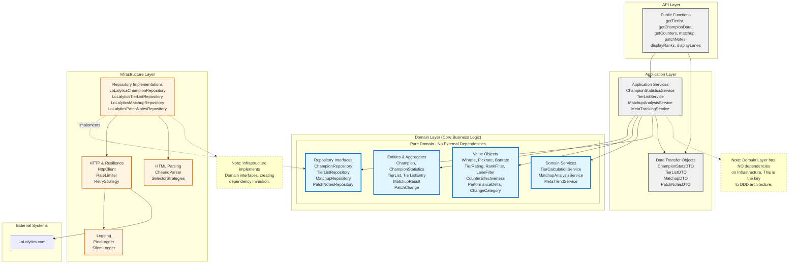

```mermaid
graph TD
    subgraph "API Layer"
        direction LR
        API[Public Functions<br/>getTierlist, getChampionData,<br/>getCounters, matchup, patchNotes,<br/>displayRanks, displayLanes]
    end

    subgraph "Application Layer"
        direction LR
        Services[Application Services<br/>ChampionStatisticsService<br/>TierListService<br/>MatchupAnalysisService<br/>MetaTrackingService]
        DTOs[Data Transfer Objects<br/>ChampionStatsDTO<br/>TierListDTO<br/>MatchupDTO<br/>PatchNotesDTO]
    end

    subgraph "Domain Layer (Core Business Logic)"
        direction TB
        subgraph "Pure Domain - No External Dependencies"
            Entities[Entities & Aggregates<br/>Champion, ChampionStatistics<br/>TierList, TierListEntry<br/>MatchupResult<br/>PatchChange]
            ValueObjects[Value Objects<br/>Winrate, Pickrate, Banrate<br/>TierRating, RankFilter, LaneFilter<br/>CounterEffectiveness<br/>PerformanceDelta, ChangeCategory]
            DomainServices[Domain Services<br/>TierCalculationService<br/>MatchupAnalysisService<br/>MetaTrendService]
            Interfaces[Repository Interfaces<br/>ChampionRepository<br/>TierListRepository<br/>MatchupRepository<br/>PatchNotesRepository]
        end
    end

    subgraph "Infrastructure Layer"
        direction LR
        Repos[Repository Implementations<br/>LoLalyticsChampionRepository<br/>LoLalyticsTierListRepository<br/>LoLalyticsMatchupRepository<br/>LoLalyticsPatchNotesRepository]
        HTTP[HTTP & Resilience<br/>HttpClient<br/>RateLimiter<br/>RetryStrategy]
        Parsing[HTML Parsing<br/>CheerioParser<br/>SelectorStrategies]
        Logging[Logging<br/>PinoLogger<br/>SilentLogger]
    end

    subgraph "External Systems"
        LoLalytics[LoLalytics.com]
    end

    %% Dependencies (arrows point to dependencies)
    API --> Services
    API --> DTOs

    Services --> Entities
    Services --> ValueObjects
    Services --> DomainServices
    Services --> Interfaces
    Services --> DTOs

    Repos -.implements.-> Interfaces
    Repos --> HTTP
    Repos --> Parsing

    HTTP --> Logging
    HTTP --> LoLalytics

    %% Key notes
    classDef domainStyle fill:#e1f5ff,stroke:#0066cc,stroke-width:3px
    classDef infraStyle fill:#fff4e1,stroke:#cc6600,stroke-width:2px
    classDef apiStyle fill:#f0f0f0,stroke:#666,stroke-width:2px

    class Entities,ValueObjects,DomainServices,Interfaces domainStyle
    class Repos,HTTP,Parsing,Logging infraStyle
    class API,Services,DTOs apiStyle

    %% Annotations
    note1[Note: Domain Layer has NO dependencies<br/>on Infrastructure. This is the key<br/>to DDD architecture.]
    note2[Note: Infrastructure implements<br/>Domain interfaces, creating<br/>dependency inversion.]

    Services -.-> note1
    Repos -.-> note2

    style note1 fill:#ffffcc,stroke:#999,stroke-dasharray: 5 5
    style note2 fill:#ffffcc,stroke:#999,stroke-dasharray: 5 5
```
