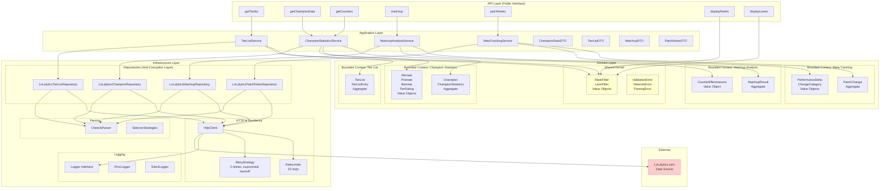

```mermaid
graph TB
    subgraph "External"
        LoLalytics[LoLalytics.com<br/>Data Source]
    end

    subgraph "API Layer (Public Interface)"
        API1[getTierlist]
        API2[getChampionData]
        API3[getCounters]
        API4[matchup]
        API5[patchNotes]
        API6[displayRanks]
        API7[displayLanes]
    end

    subgraph "Application Layer"
        ChampionStatsService[ChampionStatisticsService]
        TierListService[TierListService]
        MatchupService[MatchupAnalysisService]
        MetaService[MetaTrackingService]

        DTO1[ChampionStatsDTO]
        DTO2[TierListDTO]
        DTO3[MatchupDTO]
        DTO4[PatchNotesDTO]
    end

    subgraph "Domain Layer"
        subgraph "Bounded Context: Champion Statistics"
            ChampionEntity[Champion<br/>ChampionStatistics<br/>Aggregate]
            ChampionVO[Winrate<br/>Pickrate<br/>Banrate<br/>TierRating<br/>Value Objects]
        end

        subgraph "Bounded Context: Tier List"
            TierEntity[TierList<br/>TierListEntry<br/>Aggregate]
        end

        subgraph "Bounded Context: Matchup Analysis"
            MatchupEntity[MatchupResult<br/>Aggregate]
            MatchupVO[CounterEffectiveness<br/>Value Object]
        end

        subgraph "Bounded Context: Meta Tracking"
            MetaEntity[PatchChange<br/>Aggregate]
            MetaVO[PerformanceDelta<br/>ChangeCategory<br/>Value Objects]
        end

        subgraph "Shared Kernel"
            SharedVO[RankFilter<br/>LaneFilter<br/>Value Objects]
            SharedErrors[ValidationError<br/>NetworkError<br/>ParsingError]
        end
    end

    subgraph "Infrastructure Layer"
        subgraph "Repositories (Anti-Corruption Layer)"
            ChampionRepo[LoLalyticsChampionRepository]
            TierRepo[LoLalyticsTierListRepository]
            MatchupRepo[LoLalyticsMatchupRepository]
            PatchRepo[LoLalyticsPatchNotesRepository]
        end

        subgraph "HTTP & Resilience"
            HttpClient[HttpClient]
            RateLimiter[RateLimiter<br/>10 req/s]
            RetryStrategy[RetryStrategy<br/>2 retries, exponential backoff]
        end

        subgraph "Parsing"
            CheerioParser[CheerioParser]
            SelectorStrategies[SelectorStrategies]
        end

        subgraph "Logging"
            Logger[Logger Interface]
            PinoLogger[PinoLogger]
            SilentLogger[SilentLogger]
        end
    end

    %% API to Application
    API1 --> TierListService
    API2 --> ChampionStatsService
    API3 --> ChampionStatsService
    API4 --> MatchupService
    API5 --> MetaService
    API6 --> SharedVO
    API7 --> SharedVO

    %% Application to Domain
    ChampionStatsService --> ChampionEntity
    ChampionStatsService --> ChampionVO
    ChampionStatsService --> SharedVO
    TierListService --> TierEntity
    TierListService --> SharedVO
    MatchupService --> MatchupEntity
    MatchupService --> MatchupVO
    MetaService --> MetaEntity
    MetaService --> MetaVO

    %% Application to Infrastructure
    ChampionStatsService --> ChampionRepo
    TierListService --> TierRepo
    MatchupService --> MatchupRepo
    MetaService --> PatchRepo

    %% Infrastructure to Infrastructure
    ChampionRepo --> HttpClient
    TierRepo --> HttpClient
    MatchupRepo --> HttpClient
    PatchRepo --> HttpClient

    ChampionRepo --> CheerioParser
    TierRepo --> CheerioParser
    MatchupRepo --> CheerioParser
    PatchRepo --> CheerioParser

    HttpClient --> RateLimiter
    HttpClient --> RetryStrategy
    HttpClient --> Logger

    %% Infrastructure to External
    HttpClient --> LoLalytics

    style LoLalytics fill:#ffcccc
    style SharedVO fill:#ffffcc
    style SharedErrors fill:#ffffcc
```
