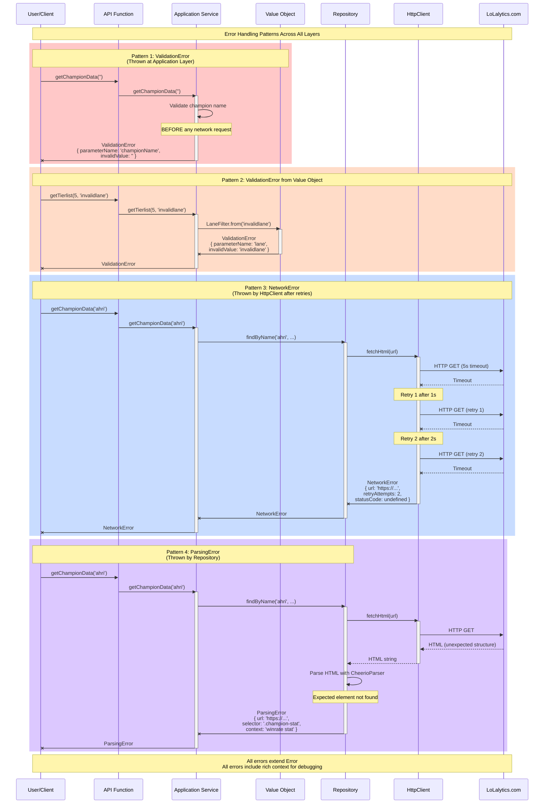

```mermaid
sequenceDiagram
    participant User as User/Client
    participant API as API Function
    participant Service as Application Service
    participant ValueObject as Value Object
    participant Repo as Repository
    participant Http as HttpClient
    participant LoLalytics as LoLalytics.com

    Note over User,LoLalytics: Error Handling Patterns Across All Layers

    rect rgb(255, 200, 200)
        Note over User,ValueObject: Pattern 1: ValidationError<br/>(Thrown at Application Layer)
        User->>API: getChampionData('')
        API->>Service: getChampionData('')
        activate Service

        Service->>Service: Validate champion name
        Note over Service: BEFORE any network request
        Service-xUser: ValidationError<br/>{ parameterName: 'championName',<br/> invalidValue: '' }
        deactivate Service
    end

    rect rgb(255, 220, 200)
        Note over User,LoLalytics: Pattern 2: ValidationError from Value Object
        User->>API: getTierlist(5, 'invalidlane')
        API->>Service: getTierlist(5, 'invalidlane')
        activate Service

        Service->>ValueObject: LaneFilter.from('invalidlane')
        activate ValueObject
        ValueObject-xService: ValidationError<br/>{ parameterName: 'lane',<br/> invalidValue: 'invalidlane' }
        deactivate ValueObject
        Service-xUser: ValidationError
        deactivate Service
    end

    rect rgb(200, 220, 255)
        Note over User,LoLalytics: Pattern 3: NetworkError<br/>(Thrown by HttpClient after retries)
        User->>API: getChampionData('ahri')
        API->>Service: getChampionData('ahri')
        activate Service
        Service->>Repo: findByName('ahri', ...)
        activate Repo
        Repo->>Http: fetchHtml(url)
        activate Http

        Http->>LoLalytics: HTTP GET (5s timeout)
        LoLalytics--xHttp: Timeout

        Note over Http: Retry 1 after 1s
        Http->>LoLalytics: HTTP GET (retry 1)
        LoLalytics--xHttp: Timeout

        Note over Http: Retry 2 after 2s
        Http->>LoLalytics: HTTP GET (retry 2)
        LoLalytics--xHttp: Timeout

        Http-xRepo: NetworkError<br/>{ url: 'https://...',<br/> retryAttempts: 2,<br/> statusCode: undefined }
        deactivate Http
        Repo-xService: NetworkError
        deactivate Repo
        Service-xUser: NetworkError
        deactivate Service
    end

    rect rgb(220, 200, 255)
        Note over User,Repo: Pattern 4: ParsingError<br/>(Thrown by Repository)
        User->>API: getChampionData('ahri')
        API->>Service: getChampionData('ahri')
        activate Service
        Service->>Repo: findByName('ahri', ...)
        activate Repo
        Repo->>Http: fetchHtml(url)
        activate Http
        Http->>LoLalytics: HTTP GET
        LoLalytics-->>Http: HTML (unexpected structure)
        Http-->>Repo: HTML string
        deactivate Http

        Repo->>Repo: Parse HTML with CheerioParser
        Note over Repo: Expected element not found
        Repo-xService: ParsingError<br/>{ url: 'https://...',<br/> selector: '.champion-stat',<br/> context: 'winrate stat' }
        deactivate Repo
        Service-xUser: ParsingError
        deactivate Service
    end

    Note over User,LoLalytics: All errors extend Error<br/>All errors include rich context for debugging
```
