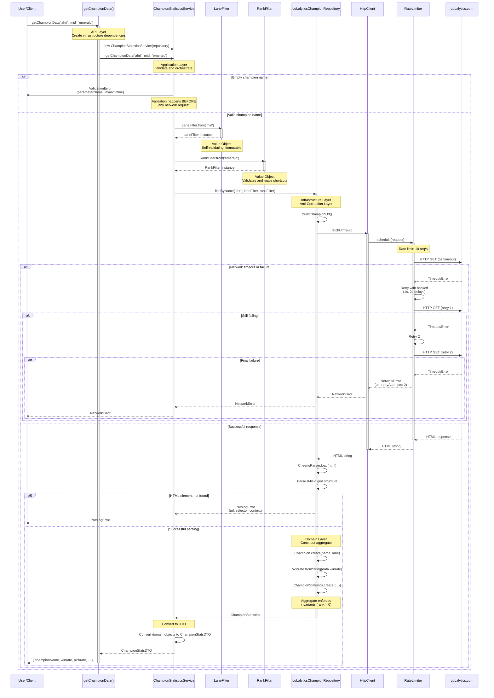

```mermaid
sequenceDiagram
    participant User as User/Client
    participant API as getChampionData()
    participant Service as ChampionStatisticsService
    participant LaneFilter as LaneFilter
    participant RankFilter as RankFilter
    participant Repo as LoLalyticsChampionRepository
    participant Http as HttpClient
    participant Limiter as RateLimiter
    participant LoLalytics as LoLalytics.com

    User->>API: getChampionData('ahri', 'mid', 'emerald')
    activate API

    Note over API: API Layer<br/>Create infrastructure dependencies
    API->>Service: new ChampionStatisticsService(repository)

    API->>Service: getChampionData('ahri', 'mid', 'emerald')
    activate Service

    Note over Service: Application Layer<br/>Validate and orchestrate

    alt Empty champion name
        Service-xUser: ValidationError<br/>(parameterName, invalidValue)
        Note over Service: Validation happens BEFORE<br/>any network request
    else Valid champion name
        Service->>LaneFilter: LaneFilter.from('mid')
        activate LaneFilter
        LaneFilter-->>Service: LaneFilter instance
        deactivate LaneFilter
        Note over LaneFilter: Value Object<br/>Self-validating, immutable

        Service->>RankFilter: RankFilter.from('emerald')
        activate RankFilter
        RankFilter-->>Service: RankFilter instance
        deactivate RankFilter
        Note over RankFilter: Value Object<br/>Validates and maps shortcuts

        Service->>Repo: findByName('ahri', laneFilter, rankFilter)
        activate Repo

        Note over Repo: Infrastructure Layer<br/>Anti-Corruption Layer
        Repo->>Repo: buildChampionUrl()

        Repo->>Http: fetchHtml(url)
        activate Http

        Http->>Limiter: schedule(request)
        activate Limiter
        Note over Limiter: Rate limit: 10 req/s
        Limiter->>LoLalytics: HTTP GET (5s timeout)

        alt Network timeout or failure
            LoLalytics--xLimiter: Timeout/Error
            Limiter->>Limiter: Retry with backoff<br/>(1s, 2s delays)
            Limiter->>LoLalytics: HTTP GET (retry 1)
            alt Still failing
                LoLalytics--xLimiter: Timeout/Error
                Limiter->>Limiter: Retry 2
                Limiter->>LoLalytics: HTTP GET (retry 2)
                alt Final failure
                    LoLalytics--xLimiter: Timeout/Error
                    Limiter--xHttp: NetworkError<br/>(url, retryAttempts: 2)
                    Http--xRepo: NetworkError
                    Repo--xService: NetworkError
                    Service--xUser: NetworkError
                end
            end
        else Successful response
            LoLalytics-->>Limiter: HTML response
            deactivate Limiter
            Limiter-->>Http: HTML string
            deactivate Http
            Http-->>Repo: HTML string

            Repo->>Repo: CheerioParser.load(html)
            Repo->>Repo: Parse 8-field grid structure

            alt HTML element not found
                Repo--xService: ParsingError<br/>(url, selector, context)
                Service--xUser: ParsingError
            else Successful parsing
                Note over Repo: Domain Layer<br/>Construct aggregate
                Repo->>Repo: Champion.create(name, lane)
                Repo->>Repo: Winrate.fromString(data.winrate)
                Repo->>Repo: ChampionStatistics.create({...})
                Note over Repo: Aggregate enforces<br/>invariants (rank > 0)

                Repo-->>Service: ChampionStatistics
                deactivate Repo

                Note over Service: Convert to DTO
                Service->>Service: Convert domain objects to ChampionStatsDTO
                Service-->>API: ChampionStatsDTO
                deactivate Service

                API-->>User: { championName, winrate, pickrate, ... }
                deactivate API
            end
        end
    end
```
