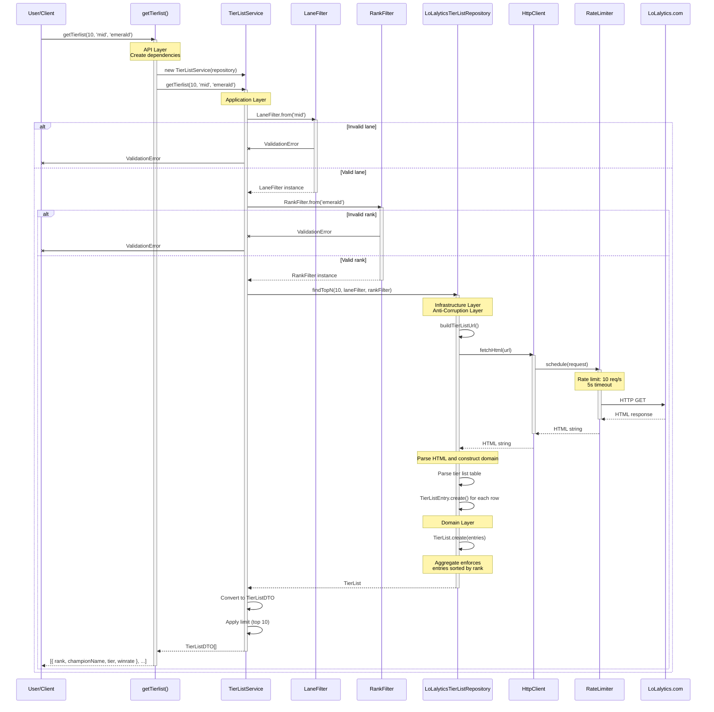

```mermaid
sequenceDiagram
    participant User as User/Client
    participant API as getTierlist()
    participant Service as TierListService
    participant LaneFilter as LaneFilter
    participant RankFilter as RankFilter
    participant Repo as LoLalyticsTierListRepository
    participant Http as HttpClient
    participant Limiter as RateLimiter
    participant LoLalytics as LoLalytics.com

    User->>API: getTierlist(10, 'mid', 'emerald')
    activate API

    Note over API: API Layer<br/>Create dependencies
    API->>Service: new TierListService(repository)
    API->>Service: getTierlist(10, 'mid', 'emerald')
    activate Service

    Note over Service: Application Layer

    Service->>LaneFilter: LaneFilter.from('mid')
    activate LaneFilter
    alt Invalid lane
        LaneFilter-xService: ValidationError
        Service-xUser: ValidationError
    else Valid lane
        LaneFilter-->>Service: LaneFilter instance
        deactivate LaneFilter

        Service->>RankFilter: RankFilter.from('emerald')
        activate RankFilter
        alt Invalid rank
            RankFilter-xService: ValidationError
            Service-xUser: ValidationError
        else Valid rank
            RankFilter-->>Service: RankFilter instance
            deactivate RankFilter

            Service->>Repo: findTopN(10, laneFilter, rankFilter)
            activate Repo

            Note over Repo: Infrastructure Layer<br/>Anti-Corruption Layer
            Repo->>Repo: buildTierListUrl()
            Repo->>Http: fetchHtml(url)
            activate Http

            Http->>Limiter: schedule(request)
            activate Limiter
            Note over Limiter: Rate limit: 10 req/s<br/>5s timeout
            Limiter->>LoLalytics: HTTP GET
            LoLalytics-->>Limiter: HTML response
            deactivate Limiter
            Limiter-->>Http: HTML string
            deactivate Http
            Http-->>Repo: HTML string

            Note over Repo: Parse HTML and construct domain
            Repo->>Repo: Parse tier list table
            Repo->>Repo: TierListEntry.create() for each row
            Note over Repo: Domain Layer
            Repo->>Repo: TierList.create(entries)
            Note over Repo: Aggregate enforces<br/>entries sorted by rank

            Repo-->>Service: TierList
            deactivate Repo

            Service->>Service: Convert to TierListDTO
            Service->>Service: Apply limit (top 10)
            Service-->>API: TierListDTO[]
            deactivate Service

            API-->>User: [{ rank, championName, tier, winrate }, ...]
            deactivate API
        end
    end
```
